# Monocle — Architecture Diagrams

Reference diagrams for the Monocle knowledge system. All diagrams use [Mermaid](https://mermaid.js.org/) syntax and render natively in GitHub, VS Code, and Obsidian.

---

## 1. System Overview — Layers & Technologies

High-level view of the four major layers and the technologies used within each.

```mermaid
graph TB
    subgraph CAPTURE["Capture Layer"]
        direction LR
        WEB["React Web App<br/>(Vite 5 / React 18)"]
        VOICE["Voice Modal<br/>(Web Speech API +<br/>MediaRecorder)"]
        MCP_CLIENT["MCP Clients<br/>(Claude, Copilot,<br/>Cursor)"]
        URL_CAPTURE["Explicit URL Capture<br/>(composer handoff / workbench)"]
    end

    subgraph API["API Layer  ·  FastAPI 0.115 · uvicorn · 127.0.0.1:8000"]
        direction TB
        INGEST_R["/api/ingest"]
        TRANSCRIBE_R["/api/transcribe"]
        NOTES_R["/api/notes"]
        SEARCH_R["/api/search"]
        GRAPH_R["/api/graph"]
        CHAT_R["/api/chat (SSE)"]
        AGENTS_R["/api/agents"]
        REVIEW_R["/api/review"]
        SETTINGS_R["/api/settings"]
        HEALTH_R["/api/health"]
        STATS_R["/api/stats"]
        MCP_R["/mcp  (Streamable HTTP)"]
    end

    subgraph SERVICES["Service Layer"]
        direction TB
        INGEST_P["IngestPipeline<br/>(8-step)"]
        WATCHER["InboxWatcher<br/>(watchdog)"]
        REINDEX_Q["ReindexQueue<br/>(asyncio coalescing)"]
        REINDEX_A["ReindexAgent<br/>(stale detection)"]
        SCHEDULER["MonocleScheduler<br/>(APScheduler 3.x)"]
        WEEKLY_A["WeeklySummaryAgent<br/>(scikit-learn clustering)"]
        ROUTING_A["RoutingAgent<br/>(sentence-starters fast-path)"]
        CHAT_A["ChatAgent<br/>(MS Agent Framework)<br/><i>tool wrappers → SVC</i>"]
        GRAPH_B["GraphBuilder<br/>(BFS, in-memory cache)"]
        MCP_S["MCP Server<br/>(FastMCP)<br/><i>tool wrappers → SVC</i>"]
    end

    subgraph SVC["Canonical Services Layer  ·  monocle/services/"]
        direction LR
        SVC_SEARCH["search.py<br/>search_vault()"]
        SVC_NOTES["notes.py<br/>read / create / update"]
        SVC_GRAPH["graph.py<br/>get_graph()"]
        SVC_REF["references.py<br/>create_reference_from_url()"]
        SVC_INGEST["ingest.py<br/>capture_thought()"]
        SVC_INGEST_SESS["ingest_sessions.py<br/>IngestSessionStore"]
        SVC_INGEST_PREP["ingest_prepare.py<br/>background prepare"]
        SVC_INGEST_EXEC["ingest_execute.py<br/>execute + validate"]
    end

    subgraph AI["AI Layer"]
        direction LR
        AI_P["AIProvider ABC<br/>(runtime-selectable)"]
        OLLAMA["OllamaProvider<br/>localhost:11434"]
        FOUNDRY["FoundryLocalProvider<br/>localhost:5272"]
        AZURE["AzureOpenAIProvider<br/>Azure AI Services"]
        OPENAI["OpenAIProvider<br/>api.openai.com"]
        WHISPER["TranscriptionProvider<br/>(WhisperCpp / Subprocess<br/>/ NativeOpenAI)"]
    end

    subgraph DATA["Data Layer"]
        direction LR
        VAULT["Vault<br/>(Markdown .md files<br/>+ YAML frontmatter)"]
        CHROMA["ChromaDB<br/>(embeddings +<br/>frontmatter metadata)"]
        INGEST_DB["IngestSessionStore<br/>(SQLite + artifacts)"]
        SOURCES["Source Archive<br/>(data/sources)"]
        CONFIG["config.yaml<br/>+ .env"]
        FAILED["FailedIngestRegistry<br/>(data/failed_ingests.json)"]
    end

    %% Capture → API
    WEB -->|REST| INGEST_R
    WEB -->|REST| NOTES_R
    WEB -->|REST| SEARCH_R
    WEB -->|REST| GRAPH_R
    WEB -->|REST| CHAT_R
    WEB -->|REST| STATS_R
    WEB -->|REST| REVIEW_R
    WEB -->|REST| SETTINGS_R
    VOICE -->|multipart| TRANSCRIBE_R
    VOICE -->|REST| INGEST_R
    URL_CAPTURE -->|REST| INGEST_R
    MCP_CLIENT -->|Streamable HTTP| MCP_R

    %% API → Services
    INGEST_R --> INGEST_P
    INGEST_R --> SVC_INGEST_SESS
    TRANSCRIBE_R --> AI_P
    NOTES_R --> REINDEX_Q
    AGENTS_R --> WEEKLY_A
    CHAT_R --> CHAT_A
    GRAPH_R --> GRAPH_B
    MCP_R --> MCP_S

    %% Services → AI
    INGEST_P --> ROUTING_A
    INGEST_P --> AI_P
    CHAT_A --> AI_P
    WEEKLY_A --> AI_P
    REINDEX_A --> AI_P
    AI_P --> OLLAMA
    AI_P --> FOUNDRY
    AI_P --> AZURE
    AI_P --> OPENAI
    AI_P --> WHISPER

    %% MCP tools and Chat agent tools → Canonical Services
    MCP_S -->|delegates to| SVC_SEARCH
    MCP_S -->|delegates to| SVC_NOTES
    MCP_S -->|delegates to| SVC_GRAPH
    MCP_S -->|delegates to| SVC_REF
    MCP_S -->|delegates to| SVC_INGEST
    CHAT_A -->|delegates to| SVC_SEARCH
    CHAT_A -->|delegates to| SVC_NOTES
    CHAT_A -->|delegates to| SVC_GRAPH
    CHAT_A -->|delegates to| SVC_REF

    %% Services → Data
    INGEST_P --> VAULT
    INGEST_P --> FAILED
    SVC_INGEST_SESS --> INGEST_DB
    SVC_INGEST_SESS --> SOURCES
    SVC_INGEST_PREP --> INGEST_DB
    SVC_INGEST_PREP --> SOURCES
    SVC_INGEST_EXEC --> INGEST_DB
    VAULT <-->|read/write| NOTES_R
    VAULT <-->|read/write| REINDEX_Q
    WATCHER -->|push| REINDEX_Q
    REINDEX_Q -->|embed + upsert| CHROMA
    REINDEX_A --> VAULT
    REINDEX_A --> CHROMA
    GRAPH_B --> VAULT
    SEARCH_R --> CHROMA
    SEARCH_R --> VAULT
    SVC_SEARCH --> CHROMA
    SVC_SEARCH --> VAULT
    SVC_NOTES --> VAULT
    SVC_NOTES --> REINDEX_Q
    SVC_GRAPH --> GRAPH_B
    SVC_REF --> VAULT
    SVC_REF --> REINDEX_Q
    SVC_INGEST --> INGEST_P

    SCHEDULER --> WEEKLY_A
    SCHEDULER --> REINDEX_A

    %% Styling
    classDef layer fill:#1e2430,stroke:#3d4f6b,color:#cdd6f4
    classDef api fill:#1e3a2f,stroke:#2d6b4a,color:#a6e3a1
    classDef service fill:#2a1f3d,stroke:#5e3d8a,color:#cba6f7
    classDef svc fill:#1e2d3d,stroke:#3d6b8a,color:#89dceb
    classDef ai fill:#3d2a1e,stroke:#8a5e3d,color:#fab387
    classDef data fill:#1e2d3d,stroke:#3d6b8a,color:#89dceb
    class CAPTURE layer
    class API api
    class SERVICES service
    class SVC svc
    class AI ai
    class DATA data
```

---

## 2. API / UI Ingest Session Flow

The primary capture path for browser/API/inbox sources: raw input is archived, persisted as a session, prepared in the background, reviewed or fast-captured, then executed into the vault.

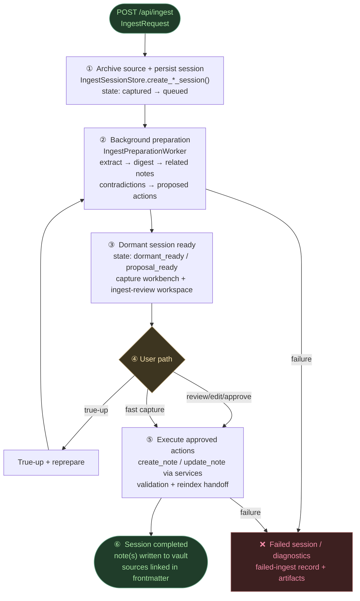

The MCP `capture_thought` tool intentionally remains a separate synchronous fast path for external clients that need a one-call ingest operation.

---

## 3. Re-index Flow — File Change to Updated Index

Shows how vault file changes (from any source) propagate to ChromaDB.

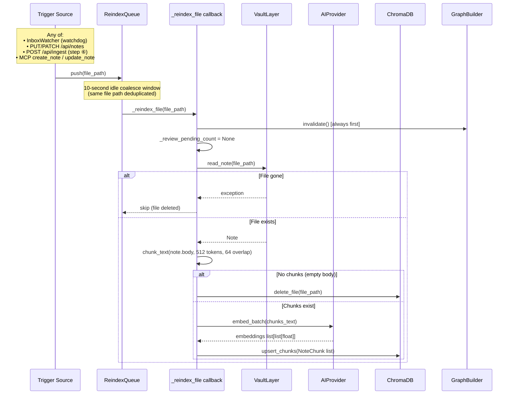

---

## 4. Chat / Agent Interaction — SSE Streaming Flow

How a user chat message flows through the agent framework to the AI and back.

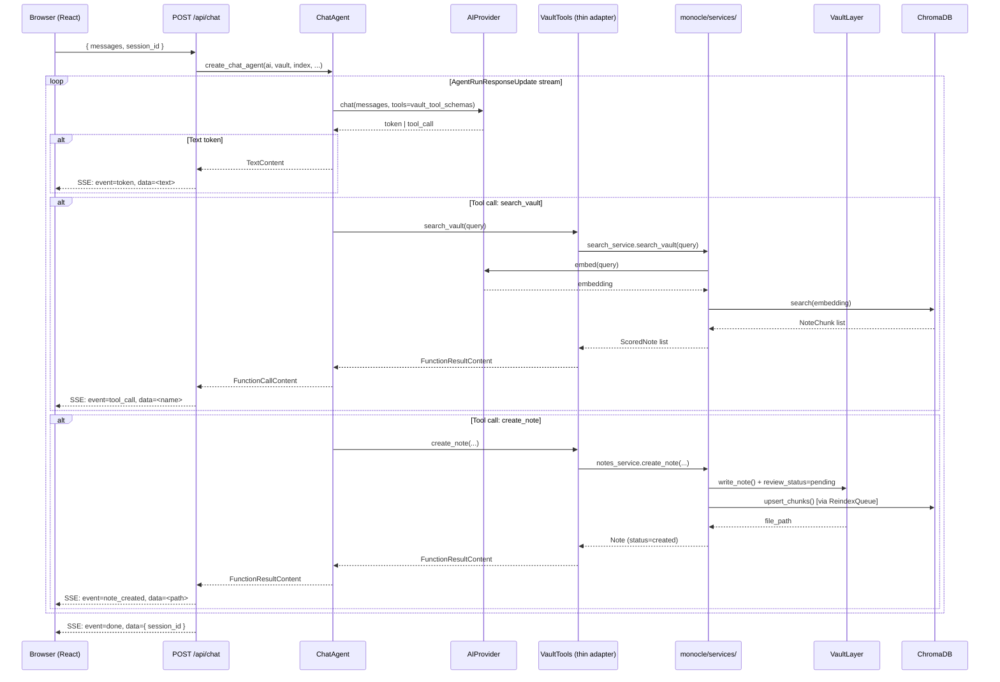

---

## 5. Weekly Summary Agent — Process Flow

The scheduled background agent that clusters notes and writes weekly summaries.

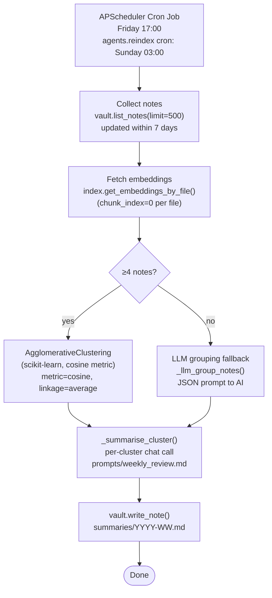

---

## 6. Frontend Component Hierarchy

React component tree and state ownership.

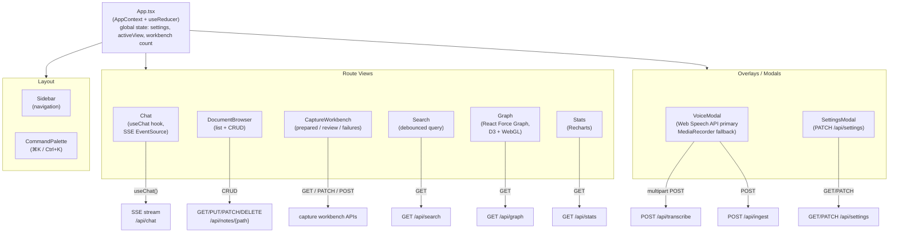

---

## 7. Data Model Relationships

Core domain entities and how they relate to each other.

```mermaid
erDiagram
    NOTE {
        string file_path PK
        string title
        string body
        float mtime
    }
    NOTE_METADATA {
        string type
        string template
        string domain
        string source
        float confidence
        string review_status
        string approved_by
        datetime created
        datetime updated
    }
    NOTE_CHUNK {
        string chunk_id PK
        string file_path FK
        int chunk_index
        string text
        list_float embedding
    }
    LINK_REF {
        string target
        string relation
    }
    GRAPH_NODE {
        string id PK
        string label
        string type
        int degree
        int weight
    }
    GRAPH_EDGE {
        string source FK
        string target FK
        string edge_type
        string relation
        int weight
    }
    FAILED_INGEST {
        string id PK
        string original_request
        string error_message
        datetime failed_at
        bool retried
    }
    INGEST_CONFIDENCE {
        float score
        float template_match
        float metadata_coverage
        float tag_plausibility
        float entity_match
        bool similar_note_detected
        string similar_note_path
    }

    NOTE ||--|| NOTE_METADATA : "has"
    NOTE ||--o{ NOTE_CHUNK : "chunked into"
    NOTE ||--o{ LINK_REF : "links to"
    NOTE_METADATA }o--o{ LINK_REF : "structured links"
    GRAPH_NODE ||--o{ GRAPH_EDGE : "source of"
    GRAPH_NODE ||--o{ GRAPH_EDGE : "target of"
    NOTE ..|| GRAPH_NODE : "maps to"
    NOTE ||--o| INGEST_CONFIDENCE : "scored by"
```

---

## 8. Process Topology — Unified Mainline

The near-term mainline supports one runtime topology: a single unified process.

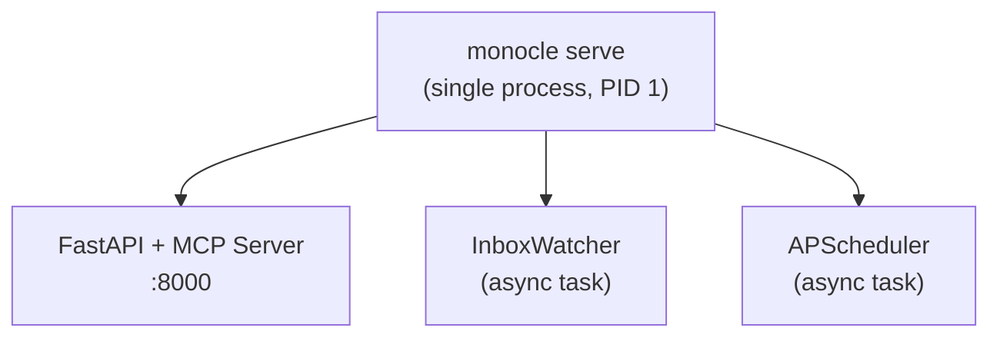

Optional process separation may be revisited in a future phase, but it is not part of the current mainline architecture.

---

## 9. MCP Server — Auth & Tool Routing

How MCP clients authenticate and which tools are available. Each tool is a thin schema wrapper that delegates to the canonical `monocle/services/` layer.

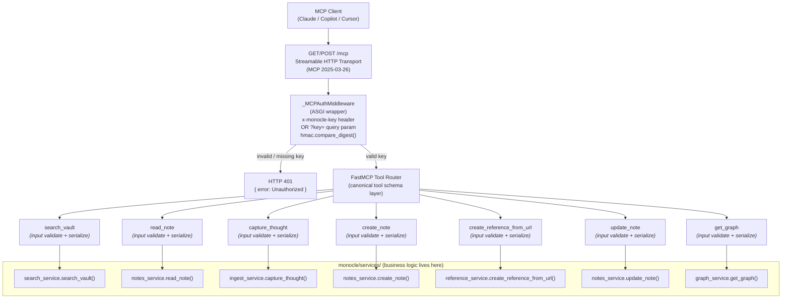

---

## 10. AI Provider Selection & Transcription

Runtime provider selection and the transcription sub-abstraction.

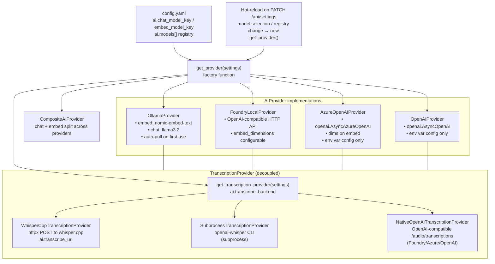

---

## 11. Confidence Scoring — Formula Breakdown

The deterministic confidence scoring algorithm (no LLM, step ⑦ of ingest).

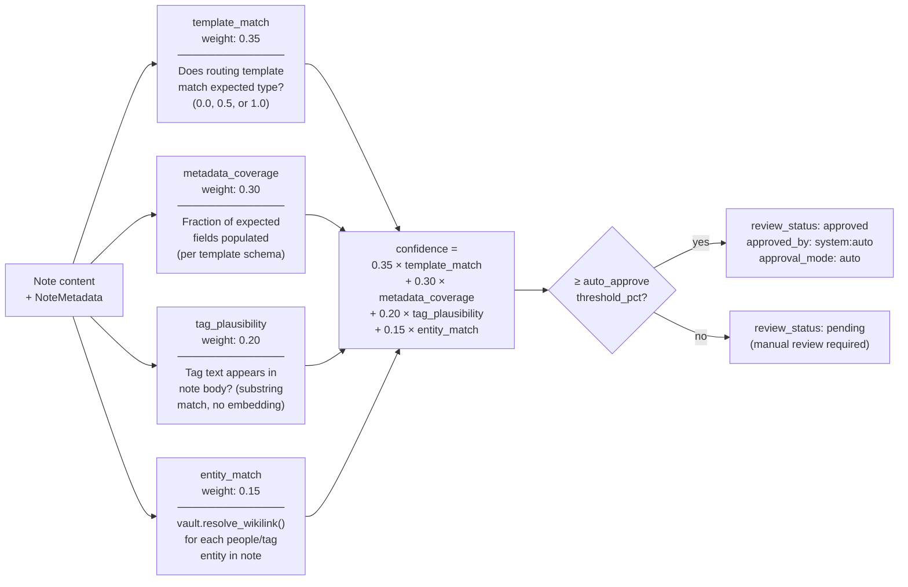

---

## 12. Vault File Layout

How the Markdown vault is structured on disk.

```
vault/
├── inbox/                    ← InboxWatcher monitors this directory
│   └── <captured notes>      ← Dropped here by AllCaptureSources → moved by IngestPipeline
├── people/                   ← type: person_note
├── projects/                 ← type: project
├── work/                     ← domain: work (decisions, observations, meeting_notes)
├── summaries/                ← type: weekly_summary  (YYYY-WW.md)
├── technologies/             ← reference notes
├── .templates/               ← User-facing Markdown templates (Obsidian)
├── .versions/                ← Shadow copy on each PUT (millisecond timestamp)
│   └── <path>/<ts_ms>.md
└── .trash/                   ← Soft-delete staging
    └── <path>.md
```

**Note frontmatter schema** (written by IngestPipeline, read by VaultLayer):

```yaml
---
title: "Example note"
type: person_note          # NOTE_TYPES enum
template: person           # vault/.templates/<template>.md
domain: work               # work | personal | ...
source: web                # web | voice | mcp | import | agent
people: ["Alice", "Bob"]
tags: ["onboarding", "q1-2026"]
action_items: []
links:
  - target: "[[projects/ProjectX]]"
    relation: "works-on"
confidence: 0.87
confidence_rationale: "..."
review_status: pending     # pending | approved | rejected
approved_by: null          # "system:auto" or user identity
approved_at: null
approval_mode: null        # auto | manual
created: 2026-03-31T10:00:00Z
updated: 2026-03-31T10:00:00Z
---
```

---

## 13. Canonical Tool Plane — MCP-First Architecture

How the MCP server and chat agent converge on the same service implementations. MCP is the authoritative external contract; chat is an orchestration layer that delegates to the same services.

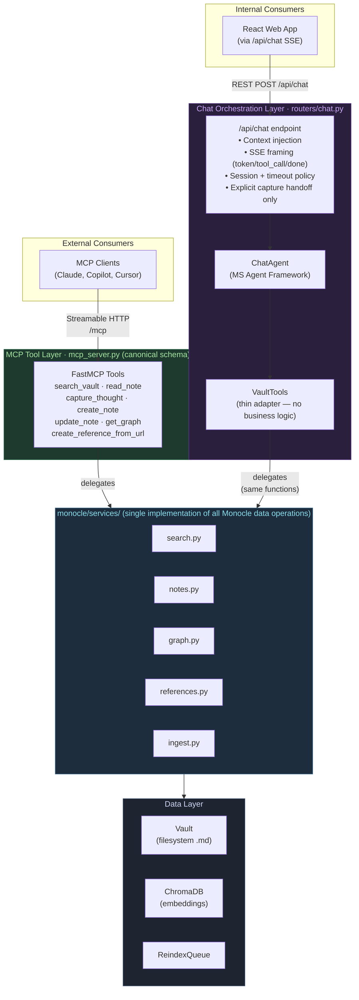

**Key invariants:**
1. Services own all business logic, side effects, validation, and reindex triggers.
2. MCP tool handlers own input schema, auth, and output serialization only.
3. Chat agent tool wrappers own agent-framework binding, tool-hint policy, and SSE event shaping only.
4. Both sets of wrappers call the same service functions — behavioral parity is structural, not conventional.
